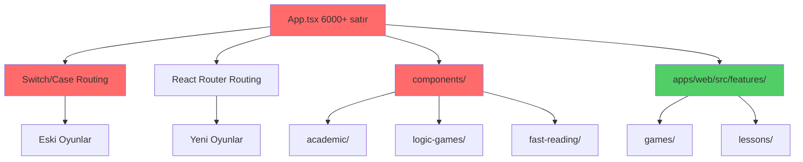
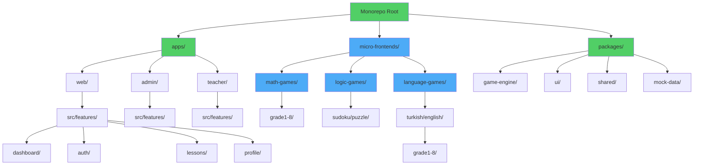
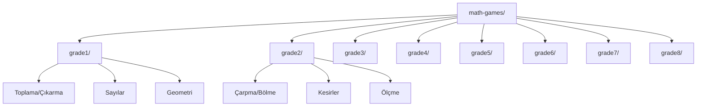
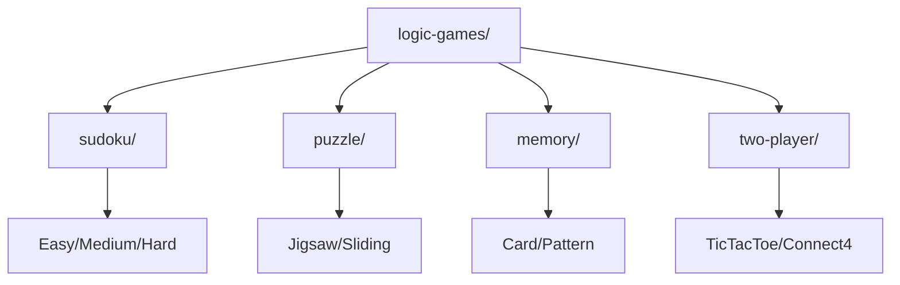
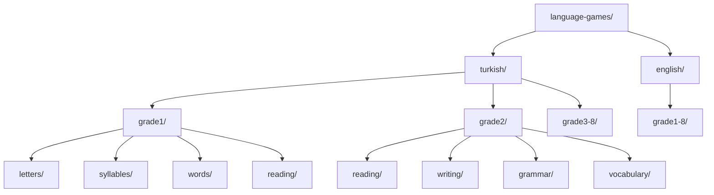
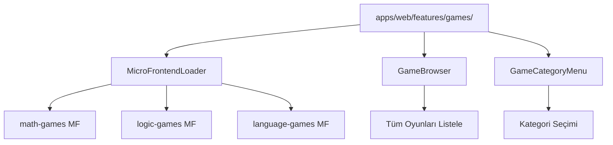

# Tasarım Belgesi: Monorepo Mimari Yeniden Yapılandırma

## Genel Bakış

Eğitim Galaksisi projesi, mevcut durumda 6000+ satırlık monolitik App.tsx dosyası ve karışık routing yapısı (switch/case + React Router) ile çalışmaktadır. Bu tasarım belgesi, projenin modern bir monorepo mimarisine geçişini, feature-based architecture'a dönüşümünü ve tüm routing yapısının React Router'a standardizasyonunu tanımlar.

**Temel Hedefler:**
- App.tsx'teki 6000+ satır kodu modüler yapıya dönüştürme
- Switch/case tabanlı routing'i tamamen kaldırma
- Tüm uygulamayı React Router tabanlı yapıya geçirme
- components/ klasörünü tamamen kaldırıp features/ yapısına geçiş
- Monorepo yapısında 3 ayrı uygulama: web (öğrenci), admin, teacher
- Shared packages ile kod tekrarını önleme

**Kapsam:**
- Mimari yeniden yapılandırma
- Routing stratejisi standardizasyonu
- Component organizasyonu
- Shared package yapısı
- Migration stratejisi

## Mimari

### Mevcut Durum Analizi



**Sorunlar:**
- App.tsx'te hem switch/case hem React Router kullanımı
- components/ ve features/ klasörleri arasında kod dağılımı
- Tutarsız routing yapısı
- Kod tekrarı ve bakım zorluğu

### Hedef Mimari



## Bileşenler ve Arayüzler

### 1. Monorepo Yapısı

#### Micro Frontends Mimarisi

**Amaç**: Oyun kategorilerini bağımsız, ölçeklenebilir micro frontend'ler olarak ayırma

**Micro Frontend Yapısı**:
```
micro-frontends/
├── math-games/              # Matematik oyunları micro frontend
│   ├── src/
│   │   ├── games/
│   │   │   ├── grade1/
│   │   │   ├── grade2/
│   │   │   ├── grade3/
│   │   │   ├── grade4/
│   │   │   ├── grade5/
│   │   │   ├── grade6/
│   │   │   ├── grade7/
│   │   │   └── grade8/
│   │   ├── components/
│   │   ├── hooks/
│   │   └── types/
│   ├── package.json
│   ├── vite.config.ts
│   └── module-federation.config.ts
│
├── logic-games/             # Mantık oyunları micro frontend
│   ├── src/
│   │   ├── games/
│   │   │   ├── sudoku/
│   │   │   ├── puzzle/
│   │   │   ├── memory/
│   │   │   └── two-player/
│   │   ├── components/
│   │   ├── hooks/
│   │   └── types/
│   ├── package.json
│   ├── vite.config.ts
│   └── module-federation.config.ts
│
└── language-games/          # Dil oyunları micro frontend
    ├── src/
    │   ├── games/
    │   │   ├── turkish/
    │   │   │   ├── grade1/
    │   │   │   ├── grade2/
    │   │   │   ├── grade3/
    │   │   │   ├── grade4/
    │   │   │   ├── grade5/
    │   │   │   ├── grade6/
    │   │   │   ├── grade7/
    │   │   │   └── grade8/
    │   │   └── english/
    │   │       ├── grade1/
    │   │       ├── grade2/
    │   │       └── ...
    │   ├── components/
    │   ├── hooks/
    │   └── types/
    ├── package.json
    ├── vite.config.ts
    └── module-federation.config.ts
```

**Module Federation Yapılandırması**:

Her micro frontend, Vite Module Federation plugin kullanarak bağımsız olarak build edilir ve runtime'da host app (apps/web) tarafından yüklenir.

```typescript
// micro-frontends/math-games/module-federation.config.ts
import { defineConfig } from '@originjs/vite-plugin-federation';

export default defineConfig({
  name: 'mathGames',
  filename: 'remoteEntry.js',
  exposes: {
    './MathGamesRouter': './src/MathGamesRouter.tsx',
    './Grade1Games': './src/games/grade1/index.ts',
    './Grade2Games': './src/games/grade2/index.ts',
    // ... diğer grade'ler
  },
  shared: {
    react: { singleton: true, requiredVersion: '^18.2.0' },
    'react-dom': { singleton: true, requiredVersion: '^18.2.0' },
    'react-router-dom': { singleton: true, requiredVersion: '^6.20.0' },
    '@egitim-galaksisi/game-engine': { singleton: true },
    '@egitim-galaksisi/ui': { singleton: true },
  }
});
```

```typescript
// apps/web/module-federation.config.ts
import { defineConfig } from '@originjs/vite-plugin-federation';

export default defineConfig({
  name: 'host',
  remotes: {
    mathGames: 'http://localhost:5001/assets/remoteEntry.js',
    logicGames: 'http://localhost:5002/assets/remoteEntry.js',
    languageGames: 'http://localhost:5003/assets/remoteEntry.js',
  },
  shared: {
    react: { singleton: true, requiredVersion: '^18.2.0' },
    'react-dom': { singleton: true, requiredVersion: '^18.2.0' },
    'react-router-dom': { singleton: true, requiredVersion: '^6.20.0' },
    '@egitim-galaksisi/game-engine': { singleton: true },
    '@egitim-galaksisi/ui': { singleton: true },
  }
});
```

**Micro Frontend Yükleme Stratejisi**:

```typescript
// apps/web/src/features/games/MicroFrontendLoader.tsx
import { lazy, Suspense } from 'react';
import { LoadingSpinner } from '@egitim-galaksisi/ui';

// Dinamik import ile micro frontend yükleme
const MathGamesRouter = lazy(() => import('mathGames/MathGamesRouter'));
const LogicGamesRouter = lazy(() => import('logicGames/LogicGamesRouter'));
const LanguageGamesRouter = lazy(() => import('languageGames/LanguageGamesRouter'));

export function MicroFrontendLoader({ category }: { category: string }) {
  const getRouter = () => {
    switch (category) {
      case 'math':
        return <MathGamesRouter />;
      case 'logic':
        return <LogicGamesRouter />;
      case 'language':
        return <LanguageGamesRouter />;
      default:
        return <div>Kategori bulunamadı</div>;
    }
  };

  return (
    <Suspense fallback={<LoadingSpinner />}>
      {getRouter()}
    </Suspense>
  );
}
```

**Deployment Stratejisi**:

Her micro frontend bağımsız olarak deploy edilir:

1. **Development**:
   - math-games: http://localhost:5001
   - logic-games: http://localhost:5002
   - language-games: http://localhost:5003
   - host (apps/web): http://localhost:5000

2. **Production**:
   - math-games: https://cdn.egitimgalaksisi.com/math-games/
   - logic-games: https://cdn.egitimgalaksisi.com/logic-games/
   - language-games: https://cdn.egitimgalaksisi.com/language-games/
   - host: https://app.egitimgalaksisi.com

**Build ve Deploy Pipeline**:

```yaml
# .github/workflows/deploy-micro-frontends.yml
name: Deploy Micro Frontends

on:
  push:
    branches: [main]
    paths:
      - 'micro-frontends/**'

jobs:
  deploy-math-games:
    runs-on: ubuntu-latest
    steps:
      - uses: actions/checkout@v3
      - name: Build math-games
        run: |
          cd micro-frontends/math-games
          npm install
          npm run build
      - name: Deploy to CDN
        run: |
          aws s3 sync dist/ s3://cdn.egitimgalaksisi.com/math-games/
          aws cloudfront create-invalidation --distribution-id ${{ secrets.CF_DIST_ID }}

  deploy-logic-games:
    runs-on: ubuntu-latest
    steps:
      - uses: actions/checkout@v3
      - name: Build logic-games
        run: |
          cd micro-frontends/logic-games
          npm install
          npm run build
      - name: Deploy to CDN
        run: |
          aws s3 sync dist/ s3://cdn.egitimgalaksisi.com/logic-games/

  deploy-language-games:
    runs-on: ubuntu-latest
    steps:
      - uses: actions/checkout@v3
      - name: Build language-games
        run: |
          cd micro-frontends/language-games
          npm install
          npm run build
      - name: Deploy to CDN
        run: |
          aws s3 sync dist/ s3://cdn.egitimgalaksisi.com/language-games/
```

**Avantajlar**:
- Bağımsız deployment (her micro frontend ayrı deploy edilebilir)
- Takım bağımsızlığı (farklı takımlar farklı micro frontend'lerde çalışabilir)
- Ölçeklenebilirlik (her micro frontend ayrı scale edilebilir)
- Teknoloji bağımsızlığı (her micro frontend farklı teknoloji kullanabilir)
- Hata izolasyonu (bir micro frontend'teki hata diğerlerini etkilemez)
- Daha küçük bundle size'lar (sadece gerekli micro frontend yüklenir)

**Dezavantajlar ve Çözümler**:
- **Shared dependency yönetimi**: Module Federation ile singleton pattern kullanımı
- **Routing koordinasyonu**: Host app'te merkezi routing yönetimi
- **State paylaşımı**: Shared packages ve event bus kullanımı
- **Development complexity**: Docker Compose ile tüm micro frontend'leri birlikte çalıştırma

#### apps/web (Öğrenci Uygulaması)

**Amaç**: Öğrencilerin oyunları oynadığı, dersleri takip ettiği ana uygulama (Host Application)

**Klasör Yapısı**:
```
apps/web/
├── src/
│   ├── features/
│   │   ├── dashboard/       # Öğrenci dashboard
│   │   ├── auth/            # Kimlik doğrulama
│   │   ├── profile/         # Profil yönetimi
│   │   ├── leaderboard/     # Sıralama tablosu
│   │   ├── analytics/       # Analitik
│   │   ├── lessons/         # Ders içerikleri (micro frontend olmayan)
│   │   ├── fast-reading/    # Hızlı okuma
│   │   ├── focus/           # Odaklanma
│   │   ├── learning/        # Öğrenme araçları
│   │   ├── language/        # Dil öğrenimi
│   │   ├── life-skills/     # Yaşam becerileri
│   │   ├── stories/         # Hikayeler
│   │   └── teacher-tools/   # Öğretmen araçları
│   ├── micro-frontend-loader/  # Micro frontend yükleme logic
│   ├── routes/              # Route tanımları
│   ├── stores/              # State management
│   ├── services/            # API servisleri
│   ├── types/               # TypeScript tipleri
│   └── utils/               # Yardımcı fonksiyonlar
├── index.html
├── package.json
├── vite.config.ts
└── module-federation.config.ts
```

**Sorumluluklar**:
- Host application (micro frontend'leri yükler)
- Öğrenci arayüzü
- Merkezi routing yönetimi
- Authentication ve authorization
- Ders içeriklerini gösterme (non-game)
- İlerleme takibi
- Sıralama tablosu


#### apps/admin (Admin Paneli)

**Amaç**: Sistem yöneticilerinin okul, öğretmen ve öğrenci yönetimini yaptığı panel

**Klasör Yapısı**:
```
apps/admin/
├── src/
│   ├── features/
│   │   ├── dashboard/       # Admin dashboard
│   │   ├── schools/         # Okul yönetimi
│   │   ├── teachers/        # Öğretmen yönetimi
│   │   ├── students/        # Öğrenci yönetimi
│   │   ├── analytics/       # Sistem analitiği
│   │   ├── settings/        # Sistem ayarları
│   │   └── reports/         # Raporlama
│   ├── routes/
│   ├── stores/
│   ├── services/
│   └── types/
├── package.json
└── vite.config.ts
```

**Sorumluluklar**:
- Okul yönetimi (CRUD)
- Öğretmen yönetimi (CRUD)
- Öğrenci yönetimi (CRUD)
- Sistem ayarları
- Raporlama ve analitik

#### apps/teacher (Öğretmen Paneli)

**Amaç**: Öğretmenlerin sınıf yönetimi, öğrenci takibi ve içerik yönetimi yaptığı panel

**Klasör Yapısı**:
```
apps/teacher/
├── src/
│   ├── features/
│   │   ├── dashboard/       # Öğretmen dashboard
│   │   ├── classes/         # Sınıf yönetimi
│   │   ├── students/        # Öğrenci takibi
│   │   ├── assignments/     # Ödev yönetimi
│   │   ├── analytics/       # Sınıf analitiği
│   │   ├── content/         # İçerik yönetimi
│   │   └── tools/           # Öğretmen araçları
│   ├── routes/
│   ├── stores/
│   ├── services/
│   └── types/
├── package.json
└── vite.config.ts
```

**Sorumluluklar**:
- Sınıf yönetimi
- Öğrenci performans takibi
- Ödev atama ve değerlendirme
- İçerik oluşturma
- Sınıf içi araçlar

### 2. Shared Packages

#### packages/game-engine

**Amaç**: Tüm oyunlar için ortak oyun motoru

**Arayüz**:
```typescript
interface GameEngine {
  // Oyun yaşam döngüsü
  initialize(config: GameConfig): void;
  start(): void;
  pause(): void;
  resume(): void;
  end(result: GameResult): void;
  
  // Skor yönetimi
  updateScore(points: number): void;
  getScore(): number;
  
  // Seviye yönetimi
  nextLevel(): void;
  getCurrentLevel(): number;
  
  // Zamanlayıcı
  startTimer(duration: number): void;
  stopTimer(): void;
  getTimeRemaining(): number;
}

interface GameConfig {
  gameId: string;
  difficulty: 'easy' | 'medium' | 'hard';
  timeLimit?: number;
  maxLives?: number;
  soundEnabled: boolean;
  animationEnabled: boolean;
}

interface GameResult {
  score: number;
  level: number;
  timeSpent: number;
  accuracy: number;
  stars: number;
  completed: boolean;
}
```

**Özellikler**:
- Oyun yaşam döngüsü yönetimi
- Skor hesaplama
- Seviye ilerlemesi
- Zamanlayıcı
- Ses ve animasyon yönetimi


#### packages/ui

**Amaç**: Tüm uygulamalar için ortak UI bileşenleri (Design System)

**Arayüz**:
```typescript
// Button Component
interface ButtonProps {
  variant: 'primary' | 'secondary' | 'danger' | 'success';
  size: 'sm' | 'md' | 'lg';
  disabled?: boolean;
  loading?: boolean;
  icon?: React.ReactNode;
  onClick: () => void;
  children: React.ReactNode;
}

// Card Component
interface CardProps {
  title?: string;
  subtitle?: string;
  image?: string;
  badge?: string;
  onClick?: () => void;
  children: React.ReactNode;
}

// Modal Component
interface ModalProps {
  isOpen: boolean;
  onClose: () => void;
  title: string;
  size?: 'sm' | 'md' | 'lg' | 'xl';
  children: React.ReactNode;
}

// Layout Components
interface LayoutProps {
  header?: React.ReactNode;
  sidebar?: React.ReactNode;
  footer?: React.ReactNode;
  children: React.ReactNode;
}
```

**Bileşenler**:
- Button, Input, Select, Checkbox, Radio
- Card, Modal, Drawer, Tooltip
- Layout, Header, Sidebar, Footer
- Table, Pagination
- Loading, ErrorBoundary
- Toast, Alert

#### packages/shared

**Amaç**: Ortak utilities, hooks ve helper fonksiyonlar

**Arayüz**:
```typescript
// Validation utilities
interface ValidationUtils {
  validateEmail(email: string): boolean;
  validatePassword(password: string): boolean;
  validateUsername(username: string): boolean;
}

// Date utilities
interface DateUtils {
  formatDate(date: Date, format: string): string;
  getRelativeTime(date: Date): string;
  isToday(date: Date): boolean;
}

// Storage utilities
interface StorageUtils {
  setItem(key: string, value: any): void;
  getItem(key: string): any;
  removeItem(key: string): void;
  clear(): void;
}

// Custom hooks
function useLocalStorage<T>(key: string, initialValue: T): [T, (value: T) => void];
function useDebounce<T>(value: T, delay: number): T;
function useMediaQuery(query: string): boolean;
```

#### packages/mock-data

**Amaç**: Geliştirme ve test için mock data

**Arayüz**:
```typescript
interface MockDataGenerator {
  generateUsers(count: number): User[];
  generateGames(count: number): Game[];
  generateLeaderboard(gameId: string): LeaderboardEntry[];
  generateProgress(userId: string): Progress[];
}
```

## Veri Modelleri

### User Model

```typescript
interface User {
  id: string;
  username: string;
  email: string;
  role: 'STUDENT' | 'TEACHER' | 'PARENT' | 'SCHOOL_ADMIN' | 'SUPER_ADMIN';
  profile: UserProfile;
  stats: UserStats;
  createdAt: Date;
  updatedAt: Date;
}

interface UserProfile {
  firstName: string;
  lastName: string;
  avatar: string;
  grade?: number;
  schoolId?: string;
  classId?: string;
}

interface UserStats {
  totalGamesPlayed: number;
  totalScore: number;
  totalStars: number;
  level: number;
  rank: number;
  achievements: Achievement[];
}
```

**Validasyon Kuralları**:
- username: 3-20 karakter, alfanumerik
- email: geçerli email formatı
- password: minimum 8 karakter, en az 1 büyük harf, 1 küçük harf, 1 rakam
- grade: 1-8 arası


### Game Model

```typescript
interface Game {
  id: string;
  title: string;
  description: string;
  category: GameCategory;
  subcategory: string;
  grade: number;
  difficulty: 'easy' | 'medium' | 'hard';
  thumbnail: string;
  route: string;
  component: string;
  tags: string[];
  isActive: boolean;
  createdAt: Date;
}

type GameCategory = 
  | 'math-games'
  | 'logic-games'
  | 'language-games'
  | 'fast-reading'
  | 'focus'
  | 'learning'
  | 'life-skills';

interface GameProgress {
  userId: string;
  gameId: string;
  level: number;
  score: number;
  stars: number;
  completedAt?: Date;
  attempts: number;
  bestScore: number;
}
```

**Validasyon Kuralları**:
- title: 3-100 karakter
- grade: 0-8 (0 = tüm seviyeler)
- difficulty: enum değerlerinden biri
- route: benzersiz, URL-safe format

### Routing Model

```typescript
interface RouteConfig {
  path: string;
  component: React.ComponentType;
  exact?: boolean;
  protected?: boolean;
  roles?: UserRole[];
  children?: RouteConfig[];
}

interface FeatureRoutes {
  basePath: string;
  routes: RouteConfig[];
}
```

## Routing Stratejisi

### Routing Mimarisi

```mermaid
graph TD
    A[AppRouter] --> B[Public Routes]
    A --> C[Protected Routes]
    
    B --> D[/login]
    B --> E[/register]
    
    C --> F[Role-Based Router]
    
    F --> G[Student Routes]
    F --> H[Teacher Routes]
    F --> I[Admin Routes]
    
    G --> J[/dashboard]
    G --> K[/games/*]
    G --> L[/lessons/*]
    G --> M[/profile]
    G --> N[/leaderboard]
    
    K --> O[/games/math/*]
    K --> P[/games/logic/*]
    K --> Q[/games/language/*]
    
    Q --> R[/games/language/turkish/*]
    Q --> S[/games/language/english/*]
    
    R --> T[/games/language/turkish/grade1/*]
    R --> U[/games/language/turkish/grade2/*]
```

### Route Yapısı

#### Öğrenci Routes (apps/web)

```typescript
// Ana routes
/                                    → StudentDashboard
/login                               → LoginPage
/register                            → RegisterPage

// Oyun routes
/games                               → GameBrowser
/games/:category                     → CategoryGames
/games/:category/:subcategory        → SubcategoryGames
/play/:gameId                        → GamePlayer

// Ders routes
/lessons                             → LessonsDashboard
/lessons/:subject                    → SubjectMenu
/lessons/:subject/grade:grade        → GradeMenu
/lessons/:subject/grade:grade/:topic → TopicGames

// Profil ve sıralama
/profile                             → ProfilePage
/profile/:userId                     → UserProfile
/leaderboard                         → LeaderboardPage
/leaderboard/:gameId                 → GameLeaderboard
```

**Örnek Route Yapısı - Türkçe Oyunları**:
```
/games/language/turkish              → Turkish Games Menu
/games/language/turkish/grade1       → Grade 1 Menu
/games/language/turkish/grade1/letters/match → Letter Match Game
/games/language/turkish/grade2/reading/fluency → Fluency Game
```


#### Öğretmen Routes (apps/teacher)

```typescript
/teacher                             → TeacherDashboard
/teacher/classes                     → ClassList
/teacher/classes/:classId            → ClassDetail
/teacher/students                    → StudentList
/teacher/students/:studentId         → StudentDetail
/teacher/assignments                 → AssignmentList
/teacher/assignments/create          → CreateAssignment
/teacher/analytics                   → Analytics
/teacher/content                     → ContentManagement
/teacher/tools                       → TeacherTools
```

#### Admin Routes (apps/admin)

```typescript
/admin                               → AdminDashboard
/admin/schools                       → SchoolList
/admin/schools/:schoolId             → SchoolDetail
/admin/teachers                      → TeacherList
/admin/teachers/:teacherId           → TeacherDetail
/admin/students                      → StudentList
/admin/students/:studentId           → StudentDetail
/admin/analytics                     → SystemAnalytics
/admin/settings                      → SystemSettings
/admin/reports                       → Reports
```

### Route Guard Stratejisi

```typescript
// Protected Route Component
interface ProtectedRouteProps {
  children: React.ReactNode;
  roles?: UserRole[];
  redirectTo?: string;
}

function ProtectedRoute({ children, roles, redirectTo = '/login' }: ProtectedRouteProps) {
  const { isAuthenticated, user, isLoading } = useAuthStore();

  if (isLoading) return <LoadingFallback />;
  if (!isAuthenticated) return <Navigate to={redirectTo} />;
  if (roles && user && !roles.includes(user.role)) return <Navigate to="/" />;
  
  return <Suspense fallback={<LoadingFallback />}>{children}</Suspense>;
}
```

**Koruma Seviyeleri**:
1. **Public**: Herkes erişebilir (login, register)
2. **Authenticated**: Giriş yapmış kullanıcılar
3. **Role-Based**: Belirli roller (STUDENT, TEACHER, ADMIN)
4. **Permission-Based**: Özel izinler (gelecek için)

## Feature-Based Architecture

### Micro Frontends (Oyun Kategorileri)

#### math-games Micro Frontend



**Klasör Yapısı**:
```
micro-frontends/math-games/
├── src/
│   ├── games/
│   │   ├── grade1/
│   │   │   ├── addition/
│   │   │   │   ├── AdditionGame.tsx
│   │   │   │   └── index.ts
│   │   │   ├── subtraction/
│   │   │   ├── numbers/
│   │   │   └── index.ts
│   │   ├── grade2/
│   │   │   ├── multiplication/
│   │   │   ├── division/
│   │   │   ├── fractions/
│   │   │   └── index.ts
│   │   └── ... (grade3-8)
│   ├── components/
│   │   ├── MathGameCard.tsx
│   │   ├── MathGamePlayer.tsx
│   │   └── MathGameMenu.tsx
│   ├── hooks/
│   │   ├── useMathGame.ts
│   │   └── useMathProgress.ts
│   ├── types/
│   │   └── index.ts
│   ├── MathGamesRouter.tsx
│   └── index.ts
├── package.json
├── vite.config.ts
└── module-federation.config.ts
```

**Exposed Modules**:
```typescript
// module-federation.config.ts
exposes: {
  './MathGamesRouter': './src/MathGamesRouter.tsx',
  './Grade1': './src/games/grade1/index.ts',
  './Grade2': './src/games/grade2/index.ts',
  './Grade3': './src/games/grade3/index.ts',
  './Grade4': './src/games/grade4/index.ts',
  './Grade5': './src/games/grade5/index.ts',
  './Grade6': './src/games/grade6/index.ts',
  './Grade7': './src/games/grade7/index.ts',
  './Grade8': './src/games/grade8/index.ts',
}
```

#### logic-games Micro Frontend



**Klasör Yapısı**:
```
micro-frontends/logic-games/
├── src/
│   ├── games/
│   │   ├── sudoku/
│   │   │   ├── SudokuGame.tsx
│   │   │   ├── SudokuSolver.ts
│   │   │   └── index.ts
│   │   ├── puzzle/
│   │   │   ├── JigsawPuzzle.tsx
│   │   │   ├── SlidingPuzzle.tsx
│   │   │   └── index.ts
│   │   ├── memory/
│   │   │   ├── CardMemoryGame.tsx
│   │   │   ├── PatternMemoryGame.tsx
│   │   │   └── index.ts
│   │   └── two-player/
│   │       ├── TicTacToe.tsx
│   │       ├── Connect4.tsx
│   │       └── index.ts
│   ├── components/
│   │   ├── LogicGameCard.tsx
│   │   └── LogicGamePlayer.tsx
│   ├── hooks/
│   │   └── useLogicGame.ts
│   ├── types/
│   │   └── index.ts
│   ├── LogicGamesRouter.tsx
│   └── index.ts
├── package.json
├── vite.config.ts
└── module-federation.config.ts
```

**Exposed Modules**:
```typescript
// module-federation.config.ts
exposes: {
  './LogicGamesRouter': './src/LogicGamesRouter.tsx',
  './Sudoku': './src/games/sudoku/index.ts',
  './Puzzle': './src/games/puzzle/index.ts',
  './Memory': './src/games/memory/index.ts',
  './TwoPlayer': './src/games/two-player/index.ts',
}
```

#### language-games Micro Frontend



**Klasör Yapısı**:
```
micro-frontends/language-games/
├── src/
│   ├── games/
│   │   ├── turkish/
│   │   │   ├── grade1/
│   │   │   │   ├── letters/
│   │   │   │   │   ├── LetterMatchGame.tsx
│   │   │   │   │   ├── VowelConsonantGame.tsx
│   │   │   │   │   └── index.ts
│   │   │   │   ├── syllables/
│   │   │   │   ├── words/
│   │   │   │   ├── reading/
│   │   │   │   └── index.ts
│   │   │   ├── grade2/
│   │   │   │   ├── reading/
│   │   │   │   ├── writing/
│   │   │   │   ├── grammar/
│   │   │   │   ├── vocabulary/
│   │   │   │   └── index.ts
│   │   │   └── ... (grade3-8)
│   │   └── english/
│   │       ├── grade1/
│   │       ├── grade2/
│   │       └── ... (grade3-8)
│   ├── components/
│   │   ├── LanguageGameCard.tsx
│   │   └── LanguageGamePlayer.tsx
│   ├── hooks/
│   │   └── useLanguageGame.ts
│   ├── types/
│   │   └── index.ts
│   ├── LanguageGamesRouter.tsx
│   └── index.ts
├── package.json
├── vite.config.ts
└── module-federation.config.ts
```

**Exposed Modules**:
```typescript
// module-federation.config.ts
exposes: {
  './LanguageGamesRouter': './src/LanguageGamesRouter.tsx',
  './TurkishGrade1': './src/games/turkish/grade1/index.ts',
  './TurkishGrade2': './src/games/turkish/grade2/index.ts',
  './TurkishGrade3': './src/games/turkish/grade3/index.ts',
  './TurkishGrade4': './src/games/turkish/grade4/index.ts',
  './TurkishGrade5': './src/games/turkish/grade5/index.ts',
  './TurkishGrade6': './src/games/turkish/grade6/index.ts',
  './TurkishGrade7': './src/games/turkish/grade7/index.ts',
  './TurkishGrade8': './src/games/turkish/grade8/index.ts',
  './EnglishGrade1': './src/games/english/grade1/index.ts',
  './EnglishGrade2': './src/games/english/grade2/index.ts',
  // ... diğer grade'ler
}
```

### Host App Features (apps/web)

#### Games Feature (Koordinasyon)



**Klasör Yapısı**:
```
apps/web/src/features/games/
├── components/
│   ├── GameBrowser.tsx          # Tüm oyunları listeler
│   ├── GameCategoryMenu.tsx     # Kategori seçim menüsü
│   ├── MicroFrontendLoader.tsx  # Micro frontend yükleme
│   └── GameCard.tsx             # Oyun kartı
├── hooks/
│   ├── useGameNavigation.ts     # Oyun navigasyonu
│   └── useGameProgress.ts       # Oyun ilerlemesi
├── types/
│   └── index.ts
├── routes.tsx                   # Game routing
└── index.ts
```

**MicroFrontendLoader Implementation**:
```typescript
// apps/web/src/features/games/components/MicroFrontendLoader.tsx
import { lazy, Suspense } from 'react';
import { LoadingSpinner } from '@egitim-galaksisi/ui';
import { ErrorBoundary } from '@egitim-galaksisi/ui';

const MathGamesRouter = lazy(() => import('mathGames/MathGamesRouter'));
const LogicGamesRouter = lazy(() => import('logicGames/LogicGamesRouter'));
const LanguageGamesRouter = lazy(() => import('languageGames/LanguageGamesRouter'));

interface MicroFrontendLoaderProps {
  category: 'math' | 'logic' | 'language';
}

export function MicroFrontendLoader({ category }: MicroFrontendLoaderProps) {
  const getRouter = () => {
    switch (category) {
      case 'math':
        return <MathGamesRouter />;
      case 'logic':
        return <LogicGamesRouter />;
      case 'language':
        return <LanguageGamesRouter />;
      default:
        return <div>Kategori bulunamadı</div>;
    }
  };

  return (
    <ErrorBoundary fallback={<div>Oyun yüklenemedi</div>}>
      <Suspense fallback={<LoadingSpinner />}>
        {getRouter()}
      </Suspense>
    </ErrorBoundary>
  );
}
```

**Game Routes**:
```typescript
// apps/web/src/features/games/routes.tsx
import { Routes, Route } from 'react-router-dom';
import { GameBrowser } from './components/GameBrowser';
import { GameCategoryMenu } from './components/GameCategoryMenu';
import { MicroFrontendLoader } from './components/MicroFrontendLoader';

export function GameRoutes() {
  return (
    <Routes>
      <Route path="/" element={<GameBrowser />} />
      <Route path="/math/*" element={<MicroFrontendLoader category="math" />} />
      <Route path="/logic/*" element={<MicroFrontendLoader category="logic" />} />
      <Route path="/language/*" element={<MicroFrontendLoader category="language" />} />
    </Routes>
  );
}
```


### Lessons Feature

```
features/lessons/
├── components/         # Ortak lesson components
│   ├── LessonCard.tsx
│   ├── SubjectMenu.tsx
│   └── GradeMenu.tsx
├── turkish/           # Türkçe dersleri
│   ├── grade1/
│   │   ├── TurkishGrade1Menu.tsx
│   │   └── index.ts
│   ├── grade2/
│   └── index.ts
├── math/              # Matematik dersleri
├── science/           # Fen bilgisi
├── english/           # İngilizce
├── AcademicDashboard.tsx
├── index.ts
└── routes.tsx
```

### Dashboard Feature

```
features/dashboard/
├── components/
│   ├── StatsCard.tsx
│   ├── RecentGames.tsx
│   ├── ProgressChart.tsx
│   └── Achievements.tsx
├── StudentDashboard.tsx
├── TeacherDashboard.tsx
├── AdminDashboard.tsx
├── ParentDashboard.tsx
├── index.ts
└── routes.tsx
```

## Hata Yönetimi

### Hata Senaryoları

#### Senaryo 1: Oyun Yükleme Hatası

**Durum**: Oyun bileşeni yüklenemediğinde
**Yanıt**: ErrorBoundary ile yakalama, kullanıcıya hata mesajı gösterme
**Kurtarma**: Ana menüye dönüş butonu, hata raporlama

```typescript
<ErrorBoundary
  fallback={<GameErrorFallback />}
  onError={(error) => logError(error)}
>
  <GamePlayer gameId={gameId} />
</ErrorBoundary>
```

#### Senaryo 2: Route Bulunamadı

**Durum**: Geçersiz route'a erişim
**Yanıt**: 404 sayfası gösterme
**Kurtarma**: Ana sayfaya yönlendirme, popüler oyunlar önerme

#### Senaryo 3: Yetki Hatası

**Durum**: Yetkisiz route'a erişim
**Yanıt**: 403 sayfası veya login'e yönlendirme
**Kurtarma**: Giriş yapma veya yetkili sayfaya yönlendirme

#### Senaryo 4: API Hatası

**Durum**: Backend API çağrısı başarısız
**Yanıt**: Toast notification ile hata mesajı
**Kurtarma**: Retry mekanizması, offline mode

## Test Stratejisi

### Unit Testing Yaklaşımı

**Test Edilecek Bileşenler**:
- Shared utilities (validation, date, storage)
- Custom hooks (useGameEngine, useGameProgress)
- Game engine fonksiyonları
- Route guards

**Test Araçları**:
- Vitest (unit testing)
- React Testing Library (component testing)
- MSW (API mocking)

**Test Coverage Hedefi**: %80+

**Örnek Test Senaryoları**:
```typescript
// Game Engine Tests
describe('GameEngine', () => {
  it('should initialize game with config', () => {});
  it('should update score correctly', () => {});
  it('should handle level progression', () => {});
  it('should calculate stars based on score', () => {});
});

// Route Guard Tests
describe('ProtectedRoute', () => {
  it('should redirect to login if not authenticated', () => {});
  it('should allow access for authenticated users', () => {});
  it('should check role permissions', () => {});
});

// Validation Tests
describe('ValidationUtils', () => {
  it('should validate email format', () => {});
  it('should validate password strength', () => {});
  it('should validate username format', () => {});
});
```


### Integration Testing Yaklaşımı

**Test Edilecek Akışlar**:
- Kullanıcı giriş/kayıt akışı
- Oyun oynama akışı (başlat → oyna → bitir → skor kaydet)
- Ders içeriği gezinme
- Profil güncelleme
- Sıralama tablosu görüntüleme

**Test Araçları**:
- Playwright (E2E testing)
- Cypress (alternatif)

**Örnek Integration Test**:
```typescript
describe('Game Playing Flow', () => {
  it('should complete full game flow', async () => {
    // 1. Login
    await page.goto('/login');
    await page.fill('[name="username"]', 'testuser');
    await page.fill('[name="password"]', 'password123');
    await page.click('button[type="submit"]');
    
    // 2. Navigate to game
    await page.click('text=Oyunlar');
    await page.click('text=Türkçe');
    await page.click('text=1. Sınıf');
    await page.click('text=Harf Eşleştirme');
    
    // 3. Play game
    await page.waitForSelector('.game-container');
    // ... game interactions
    
    // 4. Complete game
    await page.click('text=Bitir');
    await expect(page.locator('.score')).toBeVisible();
    
    // 5. Verify score saved
    await page.goto('/profile');
    await expect(page.locator('.total-score')).toContainText('100');
  });
});
```

## Performans Değerlendirmeleri

### Performans Hedefleri

**Sayfa Yükleme Süreleri**:
- İlk yükleme (FCP): < 1.5s
- Etkileşime hazır (TTI): < 3s
- Oyun başlatma: < 500ms
- Route değişimi: < 200ms

**Bundle Size Hedefleri**:
- Ana bundle: < 200KB (gzipped)
- Feature chunks: < 50KB (gzipped)
- Shared packages: < 100KB (gzipped)

### Optimizasyon Stratejileri

**1. Code Splitting**:
```typescript
// Lazy loading ile route-based splitting
const GamePlayer = lazy(() => import('./features/games/GamePlayer'));
const TurkishGrade1Menu = lazy(() => import('./features/lessons/turkish/grade1'));

// Component-level splitting
const HeavyComponent = lazy(() => import('./components/HeavyComponent'));
```

**2. Asset Optimization**:
- Image lazy loading
- WebP format kullanımı
- SVG sprite sheets
- Font subsetting

**3. Caching Stratejisi**:
```typescript
// Service Worker ile offline support
// Cache-first strategy for static assets
// Network-first strategy for API calls
// Stale-while-revalidate for game data
```

**4. Bundle Optimization**:
```typescript
// vite.config.ts
export default {
  build: {
    rollupOptions: {
      output: {
        manualChunks: {
          'vendor': ['react', 'react-dom', 'react-router-dom'],
          'game-engine': ['@egitim-galaksisi/game-engine'],
          'ui': ['@egitim-galaksisi/ui'],
        }
      }
    }
  }
}
```

**5. Rendering Optimization**:
- React.memo kullanımı
- useMemo ve useCallback hooks
- Virtual scrolling (react-window)
- Debounce/throttle

## Güvenlik Değerlendirmeleri

### Güvenlik Gereksinimleri

**1. Kimlik Doğrulama**:
- JWT token tabanlı authentication
- Refresh token mekanizması
- Token expiration (15 dakika access, 7 gün refresh)
- Secure cookie storage

**2. Yetkilendirme**:
- Role-based access control (RBAC)
- Route-level guards
- API-level permissions
- Resource ownership validation

**3. Veri Güvenliği**:
- HTTPS zorunluluğu
- XSS koruması (React default)
- CSRF token kullanımı
- SQL injection koruması (ORM kullanımı)
- Input validation (client + server)

**4. Güvenli Depolama**:
```typescript
// Hassas verileri localStorage'da saklamama
// Token'ları httpOnly cookie'de saklama
// Şifreleri asla client-side'da saklama
```

**5. API Güvenliği**:
- Rate limiting
- Request validation
- Error message sanitization
- CORS configuration

### Tehdit Modeli

**Potansiyel Tehditler**:
1. Yetkisiz erişim (çözüm: authentication + authorization)
2. XSS saldırıları (çözüm: React escaping + CSP headers)
3. CSRF saldırıları (çözüm: CSRF tokens)
4. Man-in-the-middle (çözüm: HTTPS)
5. Brute force (çözüm: rate limiting + captcha)

### Güvenlik Best Practices

```typescript
// 1. Input Sanitization
function sanitizeInput(input: string): string {
  return input.trim().replace(/[<>]/g, '');
}

// 2. Secure API Calls
async function secureApiCall(endpoint: string, data: any) {
  const token = getAccessToken();
  return fetch(endpoint, {
    method: 'POST',
    headers: {
      'Authorization': `Bearer ${token}`,
      'Content-Type': 'application/json',
      'X-CSRF-Token': getCsrfToken(),
    },
    body: JSON.stringify(data),
  });
}

// 3. Route Protection
<ProtectedRoute roles={['TEACHER', 'ADMIN']}>
  <TeacherDashboard />
</ProtectedRoute>
```


## Bağımlılıklar

### Development Environment

**Docker Compose Yapılandırması**:

Tüm micro frontend'leri ve host app'i birlikte çalıştırmak için Docker Compose kullanılır.

```yaml
# docker-compose.yml
version: '3.8'

services:
  host:
    build:
      context: .
      dockerfile: apps/web/Dockerfile.dev
    ports:
      - "5000:5000"
    volumes:
      - ./apps/web:/app/apps/web
      - ./packages:/app/packages
      - /app/node_modules
    environment:
      - VITE_MATH_GAMES_URL=http://localhost:5001
      - VITE_LOGIC_GAMES_URL=http://localhost:5002
      - VITE_LANGUAGE_GAMES_URL=http://localhost:5003
    depends_on:
      - math-games
      - logic-games
      - language-games

  math-games:
    build:
      context: .
      dockerfile: micro-frontends/math-games/Dockerfile.dev
    ports:
      - "5001:5001"
    volumes:
      - ./micro-frontends/math-games:/app/micro-frontends/math-games
      - ./packages:/app/packages
      - /app/node_modules
    environment:
      - PORT=5001

  logic-games:
    build:
      context: .
      dockerfile: micro-frontends/logic-games/Dockerfile.dev
    ports:
      - "5002:5002"
    volumes:
      - ./micro-frontends/logic-games:/app/micro-frontends/logic-games
      - ./packages:/app/packages
      - /app/node_modules
    environment:
      - PORT=5002

  language-games:
    build:
      context: .
      dockerfile: micro-frontends/language-games/Dockerfile.dev
    ports:
      - "5003:5003"
    volumes:
      - ./micro-frontends/language-games:/app/micro-frontends/language-games
      - ./packages:/app/packages
      - /app/node_modules
    environment:
      - PORT=5003

  admin:
    build:
      context: .
      dockerfile: apps/admin/Dockerfile.dev
    ports:
      - "5010:5010"
    volumes:
      - ./apps/admin:/app/apps/admin
      - ./packages:/app/packages
      - /app/node_modules

  teacher:
    build:
      context: .
      dockerfile: apps/teacher/Dockerfile.dev
    ports:
      - "5020:5020"
    volumes:
      - ./apps/teacher:/app/apps/teacher
      - ./packages:/app/packages
      - /app/node_modules
```

**Development Scripts**:

```json
// package.json (root)
{
  "scripts": {
    "dev": "docker-compose up",
    "dev:host": "cd apps/web && npm run dev",
    "dev:math": "cd micro-frontends/math-games && npm run dev",
    "dev:logic": "cd micro-frontends/logic-games && npm run dev",
    "dev:language": "cd micro-frontends/language-games && npm run dev",
    "dev:admin": "cd apps/admin && npm run dev",
    "dev:teacher": "cd apps/teacher && npm run dev",
    "dev:all": "concurrently \"npm:dev:*\"",
    "build": "turbo run build",
    "build:host": "cd apps/web && npm run build",
    "build:math": "cd micro-frontends/math-games && npm run build",
    "build:logic": "cd micro-frontends/logic-games && npm run build",
    "build:language": "cd micro-frontends/language-games && npm run build",
    "test": "turbo run test",
    "lint": "turbo run lint",
    "clean": "turbo run clean && rm -rf node_modules"
  }
}
```

### Monorepo Bağımlılıkları

**Root Level**:
```json
{
  "devDependencies": {
    "@types/node": "^20.0.0",
    "@types/react": "^18.2.0",
    "@types/react-dom": "^18.2.0",
    "@typescript-eslint/eslint-plugin": "^6.0.0",
    "@typescript-eslint/parser": "^6.0.0",
    "@originjs/vite-plugin-federation": "^1.3.0",
    "concurrently": "^8.2.0",
    "depcheck": "^1.4.0",
    "eslint": "^8.50.0",
    "husky": "^8.0.0",
    "jscpd": "^3.5.0",
    "lint-staged": "^15.0.0",
    "prettier": "^3.0.0",
    "ts-prune": "^0.10.0",
    "turbo": "^1.10.0",
    "typescript": "^5.2.0",
    "unimported": "^1.31.0",
    "vite": "^5.0.0",
    "vitest": "^1.0.0"
  }
}
```

### apps/web Bağımlılıkları

```json
{
  "dependencies": {
    "react": "^18.2.0",
    "react-dom": "^18.2.0",
    "react-router-dom": "^6.20.0",
    "zustand": "^4.4.0",
    "@egitim-galaksisi/game-engine": "workspace:*",
    "@egitim-galaksisi/ui": "workspace:*",
    "@egitim-galaksisi/shared": "workspace:*",
    "@egitim-galaksisi/mock-data": "workspace:*"
  },
  "devDependencies": {
    "@originjs/vite-plugin-federation": "^1.3.0",
    "@vitejs/plugin-react": "^4.2.0",
    "tailwindcss": "^3.3.0",
    "autoprefixer": "^10.4.0",
    "postcss": "^8.4.0"
  }
}
```

### Micro Frontend Bağımlılıkları

**math-games, logic-games, language-games**:
```json
{
  "dependencies": {
    "react": "^18.2.0",
    "react-dom": "^18.2.0",
    "react-router-dom": "^6.20.0",
    "@egitim-galaksisi/game-engine": "workspace:*",
    "@egitim-galaksisi/ui": "workspace:*",
    "@egitim-galaksisi/shared": "workspace:*"
  },
  "devDependencies": {
    "@originjs/vite-plugin-federation": "^1.3.0",
    "@vitejs/plugin-react": "^4.2.0",
    "tailwindcss": "^3.3.0",
    "vite": "^5.0.0"
  }
}
```

### packages/game-engine Bağımlılıkları

```json
{
  "dependencies": {
    "react": "^18.2.0"
  },
  "peerDependencies": {
    "react": "^18.2.0"
  }
}
```

### packages/ui Bağımlılıkları

```json
{
  "dependencies": {
    "react": "^18.2.0",
    "react-dom": "^18.2.0",
    "clsx": "^2.0.0",
    "tailwind-merge": "^2.0.0"
  },
  "peerDependencies": {
    "react": "^18.2.0",
    "react-dom": "^18.2.0"
  }
}
```

### packages/shared Bağımlılıkları

```json
{
  "dependencies": {
    "date-fns": "^2.30.0",
    "zod": "^3.22.0"
  }
}
```

### Bağımlılık Yönetimi

**Workspace Yapısı**:
```json
// package.json (root)
{
  "name": "egitim-galaksisi",
  "private": true,
  "workspaces": [
    "apps/*",
    "packages/*",
    "micro-frontends/*"
  ],
  "scripts": {
    "dev": "docker-compose up",
    "dev:all": "concurrently \"npm:dev:*\"",
    "build": "turbo run build",
    "test": "turbo run test",
    "lint": "turbo run lint",
    "clean": "turbo run clean"
  }
}
```

**Turbo Configuration**:
```json
// turbo.json
{
  "pipeline": {
    "build": {
      "dependsOn": ["^build"],
      "outputs": ["dist/**"]
    },
    "dev": {
      "cache": false,
      "persistent": true
    },
    "test": {
      "dependsOn": ["build"],
      "outputs": ["coverage/**"]
    },
    "lint": {
      "outputs": []
    },
    "clean": {
      "cache": false
    }
  }
}
```

## Migration Stratejisi

### Faz 1: Hazırlık (1 hafta)

**Hedefler**:
- Monorepo yapısını kurma
- Shared packages oluşturma
- Micro frontends dizin yapısını oluşturma
- Build sistemi kurulumu

**Adımlar**:
1. Turbo monorepo yapısını kurma
2. packages/game-engine oluşturma
3. packages/ui oluşturma
4. packages/shared oluşturma
5. packages/mock-data oluşturma
6. micro-frontends/ dizini oluşturma
7. Module Federation yapılandırması
8. Build ve dev scriptlerini yapılandırma

**Başarı Kriterleri**:
- Tüm packages başarıyla build oluyor
- Micro frontends dizin yapısı hazır
- Dev server çalışıyor
- Workspace bağımlılıkları çözülüyor
- Module Federation yapılandırması tamamlandı

### Faz 2: Routing Standardizasyonu (2 hafta)

**Hedefler**:
- Tüm switch/case routing'i kaldırma
- React Router'a tam geçiş
- Route yapısını standardize etme

**Adımlar**:
1. AppRouter.tsx'i genişletme
2. Her feature için routes.tsx oluşturma
3. Switch/case kodlarını route'lara dönüştürme
4. Route guards ekleme
5. Lazy loading implementasyonu

**Başarı Kriterleri**:
- App.tsx'te switch/case kalmadı
- Tüm oyunlar route-based
- Lazy loading çalışıyor
- Route guards aktif

### Faz 3: Component Migration (3 hafta)

**Hedefler**:
- components/ klasörünü features/'a taşıma
- Oyunları micro frontend'lere taşıma
- Feature-based organizasyon
- Kod tekrarını azaltma

**Adımlar**:
1. components/academic/math/ → micro-frontends/math-games/ taşıma
2. components/logic-games/ → micro-frontends/logic-games/ taşıma
3. components/academic/turkish/ → micro-frontends/language-games/turkish/ taşıma
4. components/academic/english/ → micro-frontends/language-games/english/ taşıma
5. components/fast-reading/ → features/fast-reading/ taşıma
6. Ortak componentleri packages/ui'ya taşıma
7. Import path'lerini güncelleme
8. Module Federation expose yapılandırması

**Başarı Kriterleri**:
- components/ klasörü boş
- Tüm oyunlar micro frontend'lerde
- Tüm componentler features/ altında
- Import path'leri doğru
- Hiçbir broken import yok
- Micro frontend'ler bağımsız çalışıyor


### Faz 4: Micro Frontends Kurulumu (2 hafta)

**Hedefler**:
- Micro frontend'leri yapılandırma
- Module Federation kurulumu
- Bağımsız build ve deploy pipeline'ları
- Host app entegrasyonu

**Adımlar**:
1. math-games micro frontend kurulumu
   - Vite + Module Federation yapılandırması
   - Exposed modules tanımlama
   - Shared dependencies yapılandırması
   - Bağımsız dev server (port 5001)
2. logic-games micro frontend kurulumu
   - Vite + Module Federation yapılandırması
   - Exposed modules tanımlama
   - Shared dependencies yapılandırması
   - Bağımsız dev server (port 5002)
3. language-games micro frontend kurulumu
   - Vite + Module Federation yapılandırması
   - Exposed modules tanımlama
   - Shared dependencies yapılandırması
   - Bağımsız dev server (port 5003)
4. Host app (apps/web) Module Federation yapılandırması
   - Remote'ları tanımlama
   - MicroFrontendLoader component'i oluşturma
   - Routing entegrasyonu
5. Docker Compose yapılandırması
   - Tüm micro frontend'leri birlikte çalıştırma
   - Development environment setup
6. CI/CD pipeline'ları
   - Her micro frontend için ayrı build job
   - CDN deployment yapılandırması
   - Versioning stratejisi

**Başarı Kriterleri**:
- Her micro frontend bağımsız çalışıyor
- Host app micro frontend'leri yükleyebiliyor
- Module Federation çalışıyor
- Shared dependencies singleton olarak yükleniyor
- Docker Compose ile tüm sistem ayağa kalkıyor
- CI/CD pipeline'ları çalışıyor

### Faz 5: App Separation (2 hafta)

**Hedefler**:
- apps/admin yapısını tamamlama
- apps/teacher yapısını tamamlama
- Role-based routing

**Adımlar**:
1. Admin dashboard'u geliştirme
2. Teacher dashboard'u geliştirme
3. Role-based route guards
4. Shared components kullanımı
5. API integration

**Başarı Kriterleri**:
- 3 ayrı app çalışıyor
- Role-based routing aktif
- Her app kendi domain'inde
- Shared packages kullanılıyor

### Faz 6: Testing & Optimization (2 hafta)

**Hedefler**:
- Test coverage artırma
- Performance optimization
- Bundle size optimization

**Adımlar**:
1. Unit testler yazma
2. Integration testler yazma
3. Bundle analysis
4. Code splitting optimization
5. Performance monitoring

**Başarı Kriterleri**:
- %80+ test coverage
- Bundle size < 200KB
- FCP < 1.5s
- TTI < 3s

### Faz 7: Kod Temizleme ve Optimizasyon (2 hafta)

**Hedefler**:
- Kullanılmayan dosyaları temizleme
- Kod kalitesini artırma
- Bundle size optimizasyonu
- Performans iyileştirmeleri

**Adımlar**:

**7.1 Kullanılmayan Bileşenleri Tespit ve Kaldırma**:
- Tüm .tsx/.ts dosyalarını tara
- Import edilmeyen bileşenleri bul
- Kullanılmayan bileşenleri sil
- Gereksiz export'ları kaldır

**Temizlenecek Dosyalar**:
```
components/                          # Tamamen kaldırılacak
├── academic/                        # → micro-frontends/ veya features/lessons/
├── logic-games/                     # → micro-frontends/logic-games/
├── fast-reading/                    # → features/fast-reading/
├── focus/                           # → features/focus/
├── learning/                        # → features/learning/
├── language/                        # → features/language/
├── first-aid/                       # → features/life-skills/first-aid/
├── traffic/                         # → features/life-skills/traffic/
├── hygiene/                         # → features/life-skills/hygiene/
├── digital/                         # → features/life-skills/digital/
├── financial/                       # → features/life-skills/financial/
├── teacher-tools/                   # → features/teacher-tools/
├── stories/                         # → features/stories/
└── common/                          # → packages/ui/ veya kaldır

App.tsx (eski versiyon)              # Yedekle ve kaldır
AppRouter.tsx (eski versiyon)        # Yeni versiyon ile değiştir
```

**7.2 Kullanılmayan Dependency'leri Kaldırma**:
- package.json'ları kontrol et
- Kullanılmayan npm paketlerini tespit et
- `npm-check` veya `depcheck` kullan
- Gereksiz dependency'leri kaldır

**Kontrol Edilecek Package'lar**:
```bash
# Her workspace için
cd apps/web && npx depcheck
cd apps/admin && npx depcheck
cd apps/teacher && npx depcheck
cd micro-frontends/math-games && npx depcheck
cd micro-frontends/logic-games && npx depcheck
cd micro-frontends/language-games && npx depcheck
```

**7.3 Duplicate Code Consolidation**:
- Duplicate code'u tespit et (jscpd kullan)
- Shared utilities'e taşı
- packages/shared/src/utils/'e ekle
- Ortak logic'i extract et

**Duplicate Code Alanları**:
- Game initialization logic
- Score calculation logic
- Timer logic
- Animation logic
- Sound effect logic
- Validation logic

**7.4 Commented-Out Code Kaldırma**:
- Tüm dosyaları tara
- Commented-out code block'larını bul ve kaldır
- TODO/FIXME comment'lerini issue'ya dönüştür
- Gereksiz console.log'ları kaldır

**Regex Pattern'ler**:
```regex
// Commented code blocks
/\/\*[\s\S]*?\*\//g
/\/\/.*$/gm

// Console statements
/console\.(log|debug|info|warn|error)\(.*\);?/g
```

**7.5 Import Statement Standardizasyonu**:
- Tüm dosyalarda import'ları alfabetik sırala
- Absolute imports önce, relative imports sonra
- Unused import'ları kaldır
- Import grouping uygula

**Import Sırası**:
```typescript
// 1. External dependencies
import React from 'react';
import { useNavigate } from 'react-router-dom';

// 2. Internal packages
import { Button } from '@egitim-galaksisi/ui';
import { useGameEngine } from '@egitim-galaksisi/game-engine';

// 3. Features
import { useAuthStore } from '@/stores/authStore';

// 4. Relative imports
import { GameCard } from './GameCard';
import type { GameProps } from './types';
```

**7.6 ESLint ve Prettier Yapılandırması**:
- Root .eslintrc.js oluştur
- Monorepo için ESLint kuralları ekle
- Prettier yapılandırması
- Pre-commit hooks (husky + lint-staged)

**ESLint Rules**:
```javascript
// .eslintrc.js
module.exports = {
  extends: [
    'eslint:recommended',
    'plugin:@typescript-eslint/recommended',
    'plugin:react/recommended',
    'plugin:react-hooks/recommended',
    'prettier'
  ],
  rules: {
    'no-console': 'warn',
    'no-unused-vars': 'error',
    '@typescript-eslint/no-explicit-any': 'error',
    'react/prop-types': 'off',
    'react/react-in-jsx-scope': 'off'
  }
};
```

**7.7 TypeScript Strict Mode**:
- tsconfig.json'da strict: true yap
- Tip hatalarını düzelt
- any kullanımını azalt
- Type safety iyileştirmeleri

**Strict Mode Ayarları**:
```json
{
  "compilerOptions": {
    "strict": true,
    "noImplicitAny": true,
    "strictNullChecks": true,
    "strictFunctionTypes": true,
    "strictBindCallApply": true,
    "strictPropertyInitialization": true,
    "noImplicitThis": true,
    "alwaysStrict": true
  }
}
```

**7.8 Bundle Size Optimization**:
- Bundle analyzer çalıştır
- Büyük dependency'leri tespit et
- Tree shaking yapılandırması
- Code splitting optimization

**Bundle Analysis**:
```bash
# Her app için
npm run build -- --analyze

# Hedefler
# - Main bundle: < 200KB (gzipped)
# - Feature chunks: < 50KB (gzipped)
# - Micro frontend bundles: < 150KB (gzipped)
```

**7.9 Asset Optimization**:
- Image optimization (WebP conversion)
- SVG optimization
- Font subsetting
- Lazy loading images

**7.10 Dead Code Elimination**:
- Unused exports tespit et
- Unused functions kaldır
- Unused types kaldır
- Tree shaking doğrula

**Tools**:
```bash
# Unused exports
npx ts-prune

# Dead code
npx unimported
```

**Başarı Kriterleri**:
- components/ klasörü tamamen kaldırıldı
- Kullanılmayan dependency'ler kaldırıldı
- Duplicate code %5'ten az
- Console.log statement'ları kaldırıldı
- Import'lar standardize edildi
- ESLint hata sayısı 0
- TypeScript strict mode aktif
- Bundle size hedefleri karşılandı
- Tüm asset'ler optimize edildi

### Faz 8: Deployment & Monitoring (1 hafta)

**Hedefler**:
- Production deployment
- Monitoring kurulumu
- Documentation

**Adımlar**:
1. Production build
2. Deployment pipeline
3. Error tracking (Sentry)
4. Analytics (Google Analytics)
5. Documentation tamamlama

**Başarı Kriterleri**:
- Production'da çalışıyor
- Monitoring aktif
- Documentation tamamlandı
- Rollback planı hazır

## Migration Checklist

### Pre-Migration

- [ ] Mevcut kod backup'ı alındı
- [ ] Git branch oluşturuldu (feature/monorepo-migration)
- [ ] Takım bilgilendirildi
- [ ] Migration planı onaylandı

### Faz 1: Hazırlık

- [ ] Turbo monorepo kuruldu
- [ ] packages/game-engine oluşturuldu
- [ ] packages/ui oluşturuldu
- [ ] packages/shared oluşturuldu
- [ ] packages/mock-data oluşturuldu
- [ ] micro-frontends/ dizini oluşturuldu
- [ ] Module Federation plugin kuruldu
- [ ] Build scripts yapılandırıldı
- [ ] Dev environment test edildi
- [ ] Docker Compose yapılandırıldı

### Faz 2: Routing

- [ ] AppRouter.tsx genişletildi
- [ ] Feature routes oluşturuldu
- [ ] Switch/case kaldırıldı
- [ ] Route guards eklendi
- [ ] Lazy loading implementasyonu
- [ ] Route testleri yazıldı

### Faz 3: Components

- [ ] components/academic/math/ → micro-frontends/math-games/ taşındı
- [ ] components/logic-games/ → micro-frontends/logic-games/ taşındı
- [ ] components/academic/turkish/ → micro-frontends/language-games/turkish/ taşındı
- [ ] components/academic/english/ → micro-frontends/language-games/english/ taşındı
- [ ] components/fast-reading/ → features/fast-reading/ taşındı
- [ ] Ortak componentler packages/ui'da
- [ ] Import path'leri güncellendi
- [ ] Component testleri yazıldı
- [ ] components/ klasörü tamamen kaldırıldı

### Faz 4: Micro Frontends

- [ ] math-games micro frontend kuruldu
- [ ] logic-games micro frontend kuruldu
- [ ] language-games micro frontend kuruldu
- [ ] Module Federation yapılandırması tamamlandı
- [ ] Host app entegrasyonu tamamlandı
- [ ] Bağımsız dev server'lar çalışıyor
- [ ] Docker Compose ile tüm sistem çalışıyor
- [ ] CI/CD pipeline'ları kuruldu

### Faz 5: Apps

- [ ] apps/admin tamamlandı
- [ ] apps/teacher tamamlandı
- [ ] Role-based routing aktif
- [ ] API integration tamamlandı
- [ ] App testleri yazıldı

### Faz 6: Testing & Optimization

- [ ] Unit testler yazıldı (%80+ coverage)
- [ ] Integration testler yazıldı
- [ ] Micro frontend testleri yazıldı
- [ ] Bundle analysis yapıldı
- [ ] Performance optimization
- [ ] Accessibility testleri

### Faz 7: Kod Temizleme

- [ ] components/ klasörü tamamen kaldırıldı
- [ ] Kullanılmayan bileşenler silindi
- [ ] Kullanılmayan dependency'ler kaldırıldı
- [ ] Duplicate code consolidate edildi
- [ ] Commented-out code kaldırıldı
- [ ] Import statement'ları standardize edildi
- [ ] Console.log'lar kaldırıldı
- [ ] ESLint yapılandırıldı (0 hata)
- [ ] Prettier yapılandırıldı
- [ ] TypeScript strict mode aktif
- [ ] Bundle size optimize edildi
- [ ] Asset'ler optimize edildi
- [ ] Dead code elimination tamamlandı

### Faz 8: Deployment

- [ ] Production build başarılı (tüm apps + micro frontends)
- [ ] Deployment pipeline kuruldu
- [ ] CDN deployment yapılandırıldı (micro frontends)
- [ ] Monitoring aktif
- [ ] Documentation tamamlandı
- [ ] Rollback planı hazır

## Risk Analizi ve Azaltma Stratejileri

### Micro Frontend Migration Stratejisi

**Aşamalı Geçiş Planı**:

1. **Faz 1: Hazırlık ve Altyapı** (1 hafta)
   - Micro frontend dizin yapısını oluştur
   - Module Federation yapılandırması
   - Development environment kurulumu

2. **Faz 2: İlk Micro Frontend (math-games)** (1 hafta)
   - Matematik oyunlarını taşı
   - Module Federation test et
   - Host app entegrasyonu
   - Production'a deploy et

3. **Faz 3: İkinci Micro Frontend (logic-games)** (1 hafta)
   - Mantık oyunlarını taşı
   - Paralel deployment test et
   - Monitoring ve logging

4. **Faz 4: Üçüncü Micro Frontend (language-games)** (1 hafta)
   - Dil oyunlarını taşı
   - Tüm micro frontend'leri birlikte test et
   - Performance optimization

**Oyun Taşıma Önceliği**:

```
Öncelik 1 (İlk taşınacaklar):
- math-games/grade1-2 (basit oyunlar, az bağımlılık)
- logic-games/sudoku (bağımsız oyun)

Öncelik 2 (Orta):
- math-games/grade3-5
- logic-games/puzzle, memory
- language-games/turkish/grade1-2

Öncelik 3 (Son):
- math-games/grade6-8 (karmaşık oyunlar)
- language-games/turkish/grade3-8
- language-games/english (tüm grade'ler)
- logic-games/two-player (multiplayer logic)
```

**Rollback Stratejisi**:

Her micro frontend için:
1. Önceki versiyon CDN'de tutulur
2. Host app'te version switching mekanizması
3. Feature flag ile yeni/eski versiyon seçimi
4. Monitoring ile hata tespit edilirse otomatik rollback

```typescript
// apps/web/src/config/microFrontendConfig.ts
export const microFrontendConfig = {
  mathGames: {
    url: process.env.VITE_MATH_GAMES_URL,
    fallbackUrl: process.env.VITE_MATH_GAMES_FALLBACK_URL,
    version: '1.0.0',
    enabled: true,
  },
  logicGames: {
    url: process.env.VITE_LOGIC_GAMES_URL,
    fallbackUrl: process.env.VITE_LOGIC_GAMES_FALLBACK_URL,
    version: '1.0.0',
    enabled: true,
  },
  languageGames: {
    url: process.env.VITE_LANGUAGE_GAMES_URL,
    fallbackUrl: process.env.VITE_LANGUAGE_GAMES_FALLBACK_URL,
    version: '1.0.0',
    enabled: true,
  },
};
```

**Monitoring ve Alerting**:

Her micro frontend için:
- Load time monitoring
- Error rate tracking
- User interaction tracking
- Performance metrics

```typescript
// Micro frontend load monitoring
const loadMicroFrontend = async (name: string, url: string) => {
  const startTime = performance.now();
  
  try {
    await import(url);
    const loadTime = performance.now() - startTime;
    
    // Log to monitoring service
    analytics.track('micro_frontend_loaded', {
      name,
      loadTime,
      success: true,
    });
    
    if (loadTime > 3000) {
      // Alert if load time > 3s
      alerting.warn(`Slow micro frontend load: ${name} (${loadTime}ms)`);
    }
  } catch (error) {
    analytics.track('micro_frontend_load_failed', {
      name,
      error: error.message,
    });
    
    // Try fallback
    await import(microFrontendConfig[name].fallbackUrl);
  }
};
```

## Risk Analizi ve Azaltma Stratejileri

### Risk 1: Migration Sırasında Downtime

**Olasılık**: Orta
**Etki**: Yüksek

**Azaltma Stratejisi**:
- Feature branch'te çalışma
- Staging environment'ta test
- Gradual rollout
- Rollback planı hazırlama

### Risk 2: Broken Dependencies

**Olasılık**: Yüksek
**Etki**: Orta

**Azaltma Stratejisi**:
- Workspace bağımlılıklarını dikkatli yönetme
- TypeScript ile type checking
- Automated tests
- Import path validation

### Risk 3: Performance Degradation

**Olasılık**: Orta
**Etki**: Orta

**Azaltma Stratejisi**:
- Performance monitoring
- Bundle size tracking
- Lazy loading
- Code splitting
- Regular performance audits

### Risk 4: User Experience Disruption

**Olasılık**: Düşük
**Etki**: Yüksek

**Azaltma Stratejisi**:
- Gradual migration
- Feature flags
- User testing
- Feedback collection
- Quick rollback capability

### Risk 5: Micro Frontend Load Failures

**Olasılık**: Orta
**Etki**: Yüksek

**Azaltma Stratejisi**:
- Fallback URL'ler
- Error boundaries
- Graceful degradation
- CDN redundancy
- Load time monitoring
- Automatic retry mechanism

### Risk 6: Shared Dependency Conflicts

**Olasılık**: Orta
**Etki**: Orta

**Azaltma Stratejisi**:
- Singleton pattern (Module Federation)
- Version pinning
- Peer dependency management
- Regular dependency audits
- Automated dependency updates

### Risk 7: Build Pipeline Complexity

**Olasılık**: Yüksek
**Etki**: Orta

**Azaltma Stratejisi**:
- Turbo monorepo caching
- Parallel builds
- Incremental builds
- Build time monitoring
- CI/CD optimizationbility

## Başarı Metrikleri

### Teknik Metrikler

**Kod Kalitesi**:
- Test coverage: %80+
- TypeScript strict mode: Aktif
- ESLint errors: 0
- Bundle size: < 200KB (gzipped)

**Performance**:
- FCP: < 1.5s
- TTI: < 3s
- Lighthouse score: > 90
- Route change: < 200ms

**Maintainability**:
- Cyclomatic complexity: < 10
- Code duplication: < 5%
- Documentation coverage: %100

### İş Metrikleri

**Geliştirme Hızı**:
- Yeni feature ekleme süresi: -50%
- Bug fix süresi: -40%
- Code review süresi: -30%

**Kullanıcı Deneyimi**:
- Sayfa yükleme süresi: -60%
- Hata oranı: -80%
- Kullanıcı memnuniyeti: +40%

## Sonuç

Bu tasarım belgesi, Eğitim Galaksisi projesinin monolitik yapıdan modern monorepo mimarisine geçişini detaylı olarak tanımlar. Hedef mimari:

1. **Modüler Yapı**: Feature-based architecture ile bakımı kolay kod
2. **Standardize Routing**: React Router ile tutarlı navigasyon
3. **Shared Packages**: Kod tekrarını önleyen ortak kütüphaneler
4. **Scalable Architecture**: Kolayca genişletilebilir yapı
5. **Better DX**: Geliştiriciler için daha iyi deneyim

Migration 6 fazda, toplam 11 haftada tamamlanacak. Her faz sonunda başarı kriterleri kontrol edilecek ve bir sonraki faza geçilecek.
